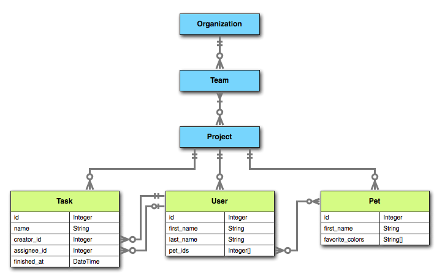
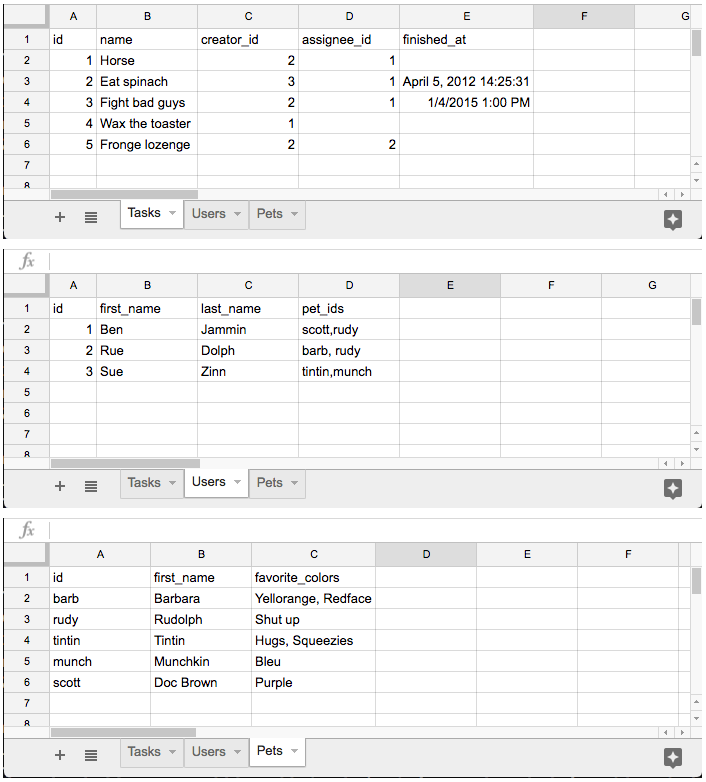

# SheetsDB

## Usage

**NOTE**: Currently, SheetsDB only supports reading and updating entities within Google Drive and Sheets; adding new entities or deleting existing ones is not available yet.  Also, updating is restricted to worksheet rows, so folders and spreadsheets are not yet renamable using SheetsDB.

### The Data Model

For the sake of documentation, we'll set up an example data model that looks like the following:



SheetsDB works with several layers of the hierarchy in Google Sheets and Drive (within a worksheet, across worksheets in a Sheet, and across folders in Drive).  We'll briefly go over each of these, and then later we'll dive more deeply.

#### Worksheets

Worksheets are the best analog we have to database tables - they contain rows, and we can use one of the rows as a header to establish columns.  In SheetsDB, a worksheet is the only way we can represent arbitrary tabular data (outside of relationships that map directly to the folder and file structure in Google Drive).  Therefore, for the example above, we'll need to use worksheets to describe the `Task`, `User`, and `Pet` models.

#### Spreadsheets

All worksheets live in a spreadsheet, and there is no way to access a worksheet or its rows outside of the spreadsheet context.  Therefore, there will always be a single parent relationship from the worksheet-based models to a spreadsheet-based model, in this case `Project`.  Note that we can't persist any arbitrary metadata at the project level in this example - if we needed to, `Project` would need to become a worksheet-based model.  Within the spreadsheet, worksheets can contain rows having relationships to rows in other worksheets.

#### Folders

Folders can contain spreadsheets, other folders, or both (obviously Drive folders can also contain other types of files, but SheetsDB ignores these).  They inherently have a zero-to-many relationship with subfolders or any number of spreadsheets, and also (unless they are root folders) can have a one-to-many relationship to parent folders.  Therefore, `Organization` and `Team` will both be folder-based models.

Note that subfolders within a folder-based model must all be the same type - there is no support for different kinds of subfolder relationships from a single folder type.  For example, in the data model we're working with, we couldn't have some subfolders of an `Organization` folder be `Team` folders while others were "`Building`" folders.  The same goes for spreadsheets within a folder-based model - only one spreadsheet type relationship is possible.

You *can*, however, have a single type of subfolder relationship and also a single type of spreadsheet relationship.  In the example above, that would mean a `Team` folder could have many spreadsheets, which would all have to be set up as `Project` spreadsheets; but also many subfolders, which would all have to be set up as the same kind of folder-based model.

### Setting Up the Structure in Google Drive

To create the structures in Google Drive to represent our example data model, we'll start at the top and work our way down the hierarchy.

#### Folders

First, go into your Google Drive account and create a new folder that will represent the top of our hierarchy.  It doesn't matter where you create this folder, since we'll reference it directly by its id within Google Drive; it can be at the root, or deep within nested folders.  Let's call this folder "Organization A" (though the folder name is meaningless); we'll map this to an `Organization` instance in SheetsDB.

Since our data model specifies that an `Organization` has zero-to-many `Team`s, and `Team` is a folder-based model, all subfolders in our new folder will represent teams.  Navigate into the "Organization A" folder and create two new folders: "Team Alpha" and "Team Bravo".  We're creating two just to demonstrate the subfolder relationship, but we'll work only in "Team Alpha" for now.

#### Spreadsheets

Navigate into the "Team Alpha" folder.  This folder represents a `Team` in our data model, and `Team`s have many `Project`s.  A `Project` is a spreadsheet-based model, so let's create a new Google Sheets spreadsheet in this folder.  Name your new empty spreadsheet "Test Project 1".  Later, when you want to create a new `Project`, you'll go back into one of your `Team` folders and create a new spreadsheet there; for now, we'll just use a single `Project` spreadsheet.

#### Worksheets

Now we get to the fun part - representing tabular data and relationships between worksheets.  In our data model, a `Project` has three child relationships - `Task`s, `User`s, and `Pet`s.  Therefore, let's create three worksheets.  What you name these worksheets is flexible and doesn't have to be the same as the relationship name, but obviously it'll be less confusing to map them semantically.  So let's call the three worksheets "Tasks", "Users", and "Pets".

Within the "Tasks" worksheet, set up a header row with each cell being one of the `Task` column names from our data model (`id`, `name`, `creator_id`, `assignee_id`, and `finished_at`).  Repeat this for the "Users" worksheet with `User` columns (`id`, `first_name`, `last_name`, and `pet_ids`), and the "Pets" worksheet with `Pet` columns (`id`, `first_name`, and `favorite_colors`).

Now let's fill in some dummy data.  Make sure any entries in association columns (like `creator_id` and `pet_ids`) reference the `id` column in their respective child worksheets.  For multiple value columns (`pet_ids` and `favorite_colors`), use a comma-separated list of values (__currently, values that contain commas themselves aren't supported - we'll add escaping in a later version__).

When you're done, your spreadsheet should look similar to the following:



**A few things to note:**

1. Empty cells will result in null values.  Blank string values are currently not supported in any way.
2. The `finished_at` column actually represents a date & time in Google Sheets and not an arbitrary string field; you can confirm this by highlighting one of those cells and seeing the value in the formula bar.  If you want to use a column as a Ruby `DateTime` in SheetsDB, make sure the actual data is formatted as `%m/%d/%Y %H:%M:%S` (single digit months and days are acceptable).
3. In comma-separated lists of values, spaces after commas are ignored, so "1, 2,  3" works just as well as "1,2,3".

### Accessing the Data

Now that we're done entering all our data, let's set up our models in Ruby so we can start reading and updating this data.  All the example model classes below are also in the [examples](example_models) directory.

#### Creating a Session

To access your files in Google Drive, you need to start by creating a SheetsDB::Session.  This is done by wrapping a GoogleDrive::Session.  There are several ways to do this, all described in the `google_drive` gem's documentation [here](https://github.com/gimite/google-drive-ruby/blob/master/doc/authorization.md).  Note that the GoogleDrive gem is already available to you if you're using SheetsDB, as it is a loaded dependency.

Once you have a GoogleDrive::Session, create a SheetsDB::Session using it:

```ruby
google_drive_session = GoogleDrive::Session.from_config("config.json")
sheets_db_session = SheetsDB::Session.new(google_drive_session)
```

You'll then use this session when fetching Sheets or folders from Google Drive, by id:

```ruby
# in this example, Organization is a class inheriting from SheetsDB::Collection
Organization.find_by_id("b3FeFCg3p-IyjdL27crOR", session: sheets_db_session)
```

However, in cases where you're using a single session for all your requests to Drive (for example, if you're using a service account rather than OAuth), you can set an instance of SheetsDB::Session as your default, and that default will be used for your requests until it's changed or the class is reloaded.

```ruby
SheetsDB::Session.default = sheets_db_session
Organization.find_by_id("b3FeFCg3p-IyjdL27crOR")
```

Make sure the user or service account you've authenticated as, in your session, has access to the folder hierarchy we created earlier.

Great, now we have a session and we can fetch resources from Google Drive!

#### Folder Models

Model classes representing folders should inherit from `SheetsDB::Collection`, and can have relationships to subfolders using the `has_many` class method.  Here is our `Organization` class:

```ruby
class Organization < SheetsDB::Collection
  has_many :teams, class_name: "Team"
end
```

Our `Team` class is similar, but specifies that `Project` children are spreadsheets (instead of subfolders), and also uses the `belongs_to_many` method to define the parent relationship to `Organization`.  Note that there is no way to restrict a folder or file's parent structure to allow only one parent; therefore, there is no `belongs_to_one` method.  If you know your structure will only ever have a single parent for a given resource, you could set up a method to access the first element of this collection, as we've done in the `Team` class:

```ruby
class Team < SheetsDB::Collection
  has_many :projects, class_name: "Project", resource_type: :spreadsheets
  belongs_to_many :organizations, class_name: "Organization"

  def organization
    organizations.first
  end
end
```

#### Spreadsheet Models

The `Project` model uses a different base class (`SheetsDB::Spreadsheet`).  From this type of model class, the `has_many` method references worksheets instead of subfolders or spreadsheets, so it has a different signature:

```ruby
class Project < SheetsDB::Spreadsheet
  has_many :tasks, worksheet_name: "Tasks", class_name: "Task"
  has_many :users, worksheet_name: "Users", class_name: "User"
  has_many :pets, worksheet_name: "Pets", class_name: "Pet"
  belongs_to_many :teams, class_name: "Team"
end
```

#### Worksheet Row Models

Finally, we get to the worksheets.  We're not trying to model the worksheets themselves - those are analogous to the schema of a table.  What we're modeling is rows within the worksheets, so each of these models will inherit from `SheetsDB::Worksheet::Row`.  We'll need to specify what the attributes are, to set up accessor methods and to specify their types; we'll also be setting up relationships to other worksheet models.  Here are the three models:

```ruby
class Task < SheetsDB::Worksheet::Row
  attribute :id, type: Integer
  attribute :name
  attribute :creator_id, type: Integer
  attribute :assignee_id, type: Integer
  attribute :finished_at, type: DateTime

  has_one :creator, from_collection: :users, key: :creator_id
  has_one :assignee, from_collection: :users, key: :assignee_id
end

class User < SheetsDB::Worksheet::Row
  attribute :id, type: Integer
  attribute :first_name
  attribute :last_name, column_name: "Last Name"
  attribute :pet_ids, multiple: true

  has_many :pets, from_collection: :pets, key: :pet_ids

  belongs_to_many :created_tasks, from_collection: :tasks, foreign_key: :creator_id
end

class Pet < SheetsDB::Worksheet::Row
  attribute :id
  attribute :first_name, transform: ->(first_name) { first_name.upcase }
  attribute :favorite_colors, multiple: true

  belongs_to_one :parent, from_collection: :users, foreign_key: :pet_ids
end
```

##### The Attribute Method

The only required argument to the `attribute` class method is the name of the column itself.  All other options are optional:

`type`: The `attribute` method currently supports five types: `Integer`, `Float`, `DateTime`, `Boolean` and the default `String`.  Any other value given to the `type` option will be ignored and the default will be used.  (Note that the `Boolean` type must be specified as a string or symbol (`type: :Boolean`) since there is no actual `Boolean` class in Ruby.)

`multiple`: This option defaults to false.  If true, it tells SheetsDB to parse the value as a comma-separated list of values, and return an array by splitting on the comma (if no comma is found, it will return a single element array).

`transform`: If you supply a Proc (or lambda) to the `transform` option, reading this column from the spreadsheet will cause it to first be sent through this transformation Proc.  For `multiple` columns, each element will be transformed independently.

`column_name`: By default, SheetsDB will use the attribute name as the name of the column to look for in the header row (first row) of the worksheet.  You can override this, however, by specifying the `column_name` option.

##### `has_many` and `has_one` associations

For associations in which the key exists in the specifying row, use `has_many` or `has_one`.  The `from_collection` parameter should reference the `has_many` entry on the Spreadsheet model that maps to the target worksheet, and the `key` parameter is the name of the local column that maps to the foreign worksheet's `id` column.

##### `belongs_to_many` and `belongs_to_one` associations

For associations in which the key exists in the foreign row, use `belongs_to_many` or `belongs_to_one`.  The `from_collection` parameter should reference the `has_many` entry on the Spreadsheet model that maps to the target worksheet, and the `foreign_key` parameter is the name of the foreign worksheet's column that maps to the local worksheet's `id` column.
